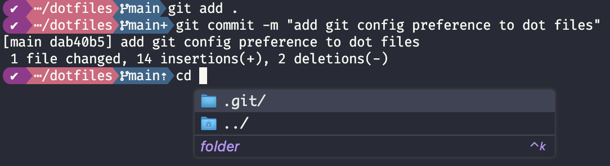

# Personal config for terminal stuff.



## Top Notes

- `.bashrc` and `.profile` are both used for bash shells, which is not as feature rich as zsh. Basically, don't use them.

## Installs

- double click `Snazzy.itermcolors`
- in `iterm -> settings -> profiles -> colors -> color presets...` select Snazzy
- `iterm -> settings -> profiles -> text -> font` choose FireCode Nerd Font Mono
- `iterm -> profiles -> keys -> key mappings -> presets -> natural text editing`

```shell
rm -f .zprofile .zshrc .bashrc  .profile
ln -s ~/dotfiles/.zprofile ~/.zprofile
ln -s ~/dotfiles/.zshrc ~/.zshrc
ln -s ~/dotfiles/.bashrc ~/.bashrc
ln -s ~/dotfiles/.profile ~/.profile

# Install Homebrew packages
brew install neofetch fzf starship fnm

# Install Homebrew cask applications
brew install --cask iterm2 amazon-q font-fira-code-nerd-font rectangle

# Install the latest LTS version of Node.js using fnm
fnm install --lts
```

- Open amazon-q app and configure
  - allow permissions
  - disable all features but CLI completions

### VS code color fix

`>preferences: Open User Settings (JSON)`

```json
{
  "terminal.integrated.minimumContrastRatio": 1
}
```

### Git Config

`~/.gitconfig`

```ini
[user]
	name = Robert Aron
	email = robert.aron.tx@gmail.com
[pull]
	rebase = false
[push]
	autoSetupRemote = true
```
